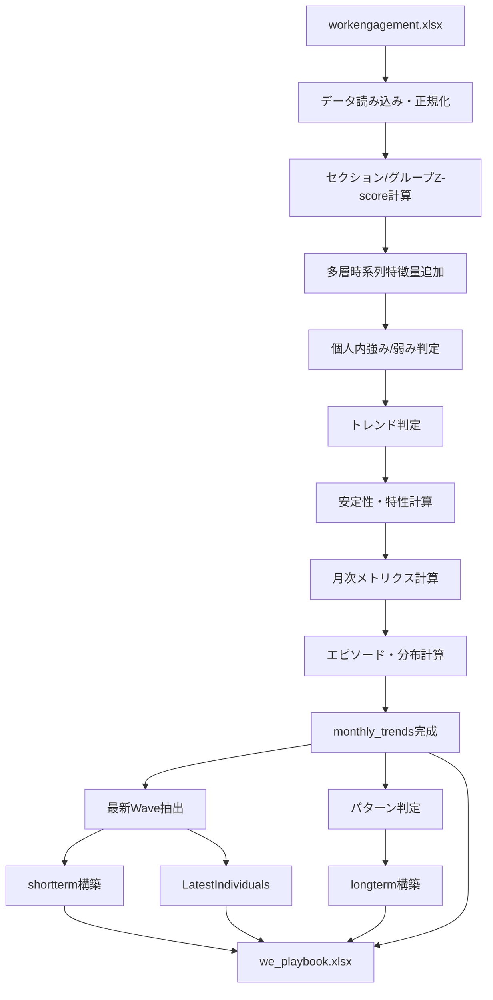
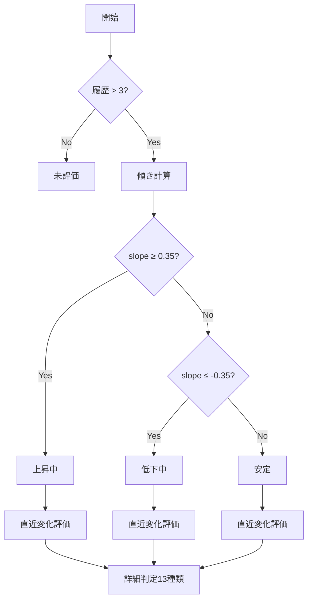

# WEプレイブック技術仕様書

**バージョン**: v3.0  
**更新日**: 2025-11-23  
**対象スクリプト**: `we_playbook.py`  
**出力ファイル**: `we_playbook.xlsx`  
**スクリプトバージョン**: we_playbook.py v2.2

---

## 目次

1. [システム概要](#1-システム概要)
2. [共通技術仕様](#2-共通技術仕様)
3. [shortterm シート仕様](#3-shortterm-シート仕様)
4. [longterm シート仕様](#4-longterm-シート仕様)
5. [monthly_trends シート仕様](#5-monthly_trends-シート仕様)
6. [LatestIndividuals シート仕様](#6-latestindividuals-シート仕様)
7. [実装仕様](#7-実装仕様)
8. [入出力仕様](#8-入出力仕様)
9. [コマンドライン仕様](#9-コマンドライン仕様)
10. [技術的考慮事項](#10-技術的考慮事項)

---

## 1. システム概要

### 1.1 目的

本システムは、ワーク・エンゲージメント（WE）測定データから、組織・個人の状態分析と介入戦略立案のためのプレイブックを自動生成する。UWES-9（Utrecht Work Engagement Scale）の測定結果を多層的に分析し、以下の4つの観点からアウトプットを提供する：

1. **即応アクション判断**（shortterm）
2. **長期育成・配置戦略**（longterm）
3. **詳細時系列分析**（monthly_trends）
4. **最新状態スナップショット**（LatestIndividuals）

### 1.2 システム構成

#### 1.2.1 シート構成と出力順序

| 順序 | シート名 | 目的 | 行粒度 |
|------|----------|------|--------|
| 1 | shortterm | 最新Wave時点のメンバー短期状態（即応アクション判断用） | 1人 × 最新Wave |
| 2 | longterm | 個人の長期傾向・特性サマリー（育成・配置戦略用） | 1人（全期間集計） |
| 3 | monthly_trends | 全員×全Waveの時系列データ（検証・分析用） | 1人 × 1Wave |
| 4 | LatestIndividuals | 最新Waveのみの時系列データ | 1人 × 最新Wave |

#### 1.2.2 入力データ要件

**必須列**
- `year`: 測定年（整数）
- `month`: 測定月（整数）
- `mail_address` または `name`: 個人識別子（文字列）
- `vigor_rating`: 活力評価（0-18の整数）
- `dedication_rating`: 熱意評価（0-18の整数）
- `absorption_rating`: 没頭評価（0-18の整数）

**オプション列**
- `engagement_rating`: 総エンゲージメント（0-54の整数、無い場合はV+D+Aで算出）
- `project`: 所属プロジェクト（文字列）
- `grade`: 等級（文字列/数値）
- `section`: 部署（文字列）
- `group`: グループ（文字列、空の場合はsectionを使用）

### 1.3 技術スタック

- **言語**: Python 3.x
- **必須ライブラリ**: pandas, numpy, pathlib, argparse
- **オプション**: xlsxwriter（Excel形式設定用）

---

## 2. 共通技術仕様

### 2.1 主要定数定義

#### 2.1.1 トレンド検出定数

| 定数名 | 値 | 用途 |
|--------|-----|------|
| `TREND_SLOPE_POS` | 0.35 | 上昇トレンド判定の傾き閾値 |
| `TREND_SLOPE_NEG` | -0.35 | 低下トレンド判定の傾き閾値 |
| `TREND_MOMENTUM_STRONG` | 1.5 | 強いモメンタムの閾値 |
| `TREND_DELTA_STRONG` | 5.0 | 強い変化の閾値 |
| `TREND_DELTA` | 1.0 | 有意な変化の最小幅 |

#### 2.1.2 レベル分類定数

| 定数名 | 値 | 判定条件 |
|--------|-----|----------|
| `LEVEL_THRIVING` | 43 | Engagement > 43 |
| `LEVEL_HIGH` | 32 | 32 < Engagement ≤ 43 |
| `LEVEL_LOW` | 11 | 3 ≤ Engagement < 11 |
| `LEVEL_CRITICAL` | 3 | Engagement < 3 |

**Level_A分類ロジック**
```
if Engagement > 43: "Thriving"
elif Engagement > 32: "High"
elif Engagement >= 11: "Moderate"
elif Engagement >= 3: "Low"
else: "Critical"
```

#### 2.1.3 安定性評価定数

**短期（6ヶ月）安定性**
| 定数名 | 値 | 用途 |
|--------|-----|------|
| `STABILITY_STD_STABLE` | 1.0 | E_std_6 ≤ この値で「安定」 |
| `STABILITY_MOMENTUM_STABLE` | 0.5 | \|E_momentum_3\| < この値で「安定」 |
| `STABILITY_STD_UNSTABLE` | 2.5 | E_std_6 ≥ この値で「不安定」 |
| `C_STABILITY_RANGE_EPS` | 1e-6 | 不変判定の許容誤差 |

直近 6 ヶ月における個人内標準偏差 E_std_6 の実測分布（N = 1,917）は、中央値 1.86、平均 2.36、標準偏差 2.45 であり、約 10% のケースが 0（6ヶ月間変動なし）、一部のケースでは 6 以上、最大 27 という大きな値を示す強い右裾の分布となっていた。
この分布に基づき、本研究では短期安定性指標 C_stability の閾値として 1.5 および 3.3 を採用した。
E_std_6 ≤ 1.5 のケースは全体の約 40%、E_std_6 ≥ 3.3 のケースは約 20% を占めており、それぞれ実測分布における約 40 パーセンタイルおよび 80 パーセンタイルに対応する。
したがって、C_stability における「安定」「不安定」は、E_std_6 の経験的分布に基づき、

* 安定：E_std_6 ≤ 1.5（揺れが比較的小さい下位約 40%）
* 不安定：E_std_6 ≥ 3.3（揺れが大きい上位約 20%）
* やや安定：その中間（1.5＜E_std_6＜3.3）

という 3 区分として定義される。

**長期（12ヶ月）安定性**
| 定数名 | 値 | 用途 |
|--------|-----|------|
| `STABILITY_STD_STABLE_LONG` | 1.5 | E_std_12 ≤ この値で「持続安定」 |
| `STABILITY_MOMENTUM_STABLE_LONG` | 0.8 | \|E_momentum_6\| < この値で「持続安定」 |
| `STABILITY_STD_UNSTABLE_LONG` | 3.0 | E_std_12 ≥ この値で「持続不安定」 |

#### 2.1.4 特性分析定数

| 定数名 | 値 | 用途 |
|--------|-----|------|
| `TRAIT_WINDOW_MONTHS` | 12 | 特性評価のローリングウィンドウ |
| `TRAIT_MIN_PERIODS` | 3 | 最小データ点数 |
| `SECTION_THRESHOLD` | 0.5 | セクション内Z-score閾値 |
| `TRAIT_MIN_HISTORY` | 6 | 特性評価に必要な最小履歴数 |
| `TRAIT_LEVEL_RATIO_MAX` | 0.8 | 短期履歴でのHigh/Low比率上限 |
| `TRAIT_LEVEL_RATIO_MIN` | 0.6 | 長期履歴でのHigh/Low比率下限 |
| `TRAIT_LEVEL_RATIO_DECAY` | 12 | 閾値緩和期間（月） |

#### 2.1.5 その他の定数

| 定数名 | 値 | 用途 |
|--------|-----|------|
| `CHANGE_TAG_THRESHOLD` | 6.0 | 「変化大」タグ付与基準 |
| `CONSTANT_PERIOD_DAYS` | 183 | 入力疑義判定期間（6ヶ月） |
| `MID_MIN_RECORDS` | 3 | 中期指標計算の最小履歴数 |
| `PATTERN_DOMINANCE_RATIO` | 0.7 | パターン判定の支配率閾値 |
| `PATTERN_MIN_DATA_POINTS` | 3 | パターン判定の最小データ点数 |
| `SLOPE_PATTERN_WINDOW` | 12 | パターン判定の期間 |

### 2.2 核心アルゴリズム

#### 2.2.1 Theil-Sen傾き推定

**実装**: `_theil_sen_slope_window(y, max_len)`

Theil-Sen推定は、全データペアの傾きの中央値を使用する頑健な推定手法：

```python
slopes = [(arr[j] - arr[i]) / (j - i) 
          for i in range(n - 1) 
          for j in range(i + 1, n)]
return np.median(slopes)
```

**特徴**
- 外れ値に対して頑健（スパイク的変動の影響を受けにくい）
- 最小二乗法より安定した傾向検出
- 使用箇所：E_slope_6, E_slope_12, V/D/A_slope_6

#### 2.2.2 Expanding Robust Z-score

**実装**: `_expanding_robust_z_exclusive(series, eps=1e-9)`

個人の過去データに対する現在値の異常度を評価：

```
Z = (x - Median_past) / (1.4826 × MAD_past)
```

- **Median_past**: 当該月を除く過去全データの中央値
- **MAD_past**: 中央絶対偏差（Median Absolute Deviation）
- **1.4826**: 正規分布仮定時のMADから標準偏差への変換係数

**特徴**
- 正規分布を仮定しない
- 個人の変動パターンに適応的
- 使用箇所：C_short_strength/weakness, C_mid_strength/weakness

#### 2.2.3 レベルバンド化

**実装**: `bandify_level(x)`

5段階のLevel_Aを3バンドに集約：

| バンド | Level_A の値 |
|--------|-------------|
| High | Thriving, High |
| Mid | Moderate |
| Low | Low, Critical |

**注意**: Critical は Low と同じ扱い、Thriving は High と同じ扱い

#### 2.2.4 動的閾値調整

**実装**: `_dynamic_level_ratio_threshold(history_len)`

観測履歴に応じて要求される High/Low 比率を線形緩和：

```
if history_len ≤ 6: return 0.8
if history_len ≥ 18: return 0.6
else: linear interpolation between 0.8 and 0.6
```

### 2.3 介入優先度スコアリング

**実装場所**: `build_shortterm()` 内

基礎スコア：
- 低下加速: 10点
- 低下危機: 8点
- 悪化: 6点
- 低下継続: 4点
- 復活: 2点
- 回復: 3点
- 低下懸念: 2点
- 低下警戒: 1点
- 上昇加速: 1点

ボーナス加算：
- Level_A が Low/Critical: +1点
- |E_delta_1| ≥ 6.0 かつ負方向: +2点
- |E_delta_1| ≥ 6.0 かつ正方向: +1点
- C_stability が「不安定」: +1点
- ChangeTag が「変化大」: +1点

---

## 3. shortterm シート仕様

### 3.1 目的と用途

最新Wave時点でのメンバーの短期状態を評価し、即座の介入が必要なケースを特定する。マネージャーが1on1や個別サポートの優先順位を決定するための実践的ビュー。

### 3.2 外部仕様（列定義）

| 列名 | 型 | 説明 |
|------|-----|------|
| `__person__` | 文字列 | 個人ID（mail_addressの小文字・trim正規化） |
| `name` | 文字列 | 氏名 |
| `project` | 文字列 | 所属プロジェクト/ユニット |
| `grade` | 文字列/数値 | 等級 |
| `__section__` | 文字列 | 部署（大分類） |
| `__group__` | 文字列 | グループ（中分類） |
| `__wave__` | 日付(yyyy-mm) | Wave（月末Timestamp） |
| `Level_A` | カテゴリ | Thriving / High / Moderate / Low / Critical |
| `Trend_B_refined` | カテゴリ | 詳細トレンド（13種類） |
| `InterventionPriority` | 整数 | 介入優先度スコア（0-20程度） |
| `flag_constant_6m` | 真偽 | 直近6ヶ月以上E/V/D/A不変フラグ |
| `ShortTerm_ArchetypeJP` | 文字列 | Level_A × Trend_B_refined |
| `AnalysisFlag` | カテゴリ | 有効 / 分析不可（入力疑義） |

### 3.3 内部仕様（判定ロジック）

#### 3.3.1 Trend_B_refined（13種類の詳細トレンド）

**判定優先順位（上から順に評価）**

1. **加速/急変系**
   - `上昇加速`: 上昇中 ∧ 最近上昇 ∧ slope≥0.35 ∧ delta≥5.0 ∧ (強momentum ∨ 連続強delta)
   - `低下加速`: 低下中 ∧ 最近下降 ∧ slope≤-0.35 ∧ delta≤-5.0 ∧ (強momentum ∨ 連続強delta)
   - `悪化`: 上昇中 → 急落（delta≤-5.0） ∧ current_E ≥ min6_past
   - `低下危機`: 上昇中 → 急落（delta≤-5.0） ∧ current_E < min6_past

2. **回復/復活系**
   - `回復`: (低下中 ∨ 前回低下中) → 急騰（delta≥5.0） ∧ current_E ≤ max6_past
   - `復活`: (低下中 ∨ 前回低下中) → 急騰（delta≥5.0） ∧ current_E > max6_past

3. **継続系**
   - `上昇継続`: 上昇中 ∧ 横ばい ∧ 安定的なモメンタム
   - `低下継続`: 低下中 ∧ 横ばい ∧ 安定的なモメンタム

4. **期待/警戒系**
   - `上昇期待`: 安定 → 上昇 ∧ delta > 1.0
   - `低下警戒`: 安定 → 下降 ∧ delta < -1.0
   - `低下懸念`: 上昇中 → 横ばい ∧ delta < -1.0
   - `回復期待`: 低下中 ∧ 横ばい ∧ delta > 1.0

5. **その他**
   - `安定維持`: 上記いずれにも該当しない安定状態
   - `未評価`: 履歴不足（データ点数 < 3）

#### 3.3.2 flag_constant_6m（入力妥当性チェック）

**実装ロジック**
1. 各個人の時系列をWave昇順でソート
2. 比較タプル: `(Engagement, vigor_rating, dedication_rating, absorption_rating)`
3. 同一値が連続する期間を計測
4. 最長連続期間 ≥ 183日（6ヶ月）なら TRUE

#### 3.3.3 AnalysisFlag

```
if flag_constant_6m == TRUE AND Trend_B_refined == "安定維持":
    "分析不可（入力疑義）"
else:
    "有効"
```
#### 3.3.4 ShortTerm_Archetype（短期アーキタイプ）
shortterm シートでは、最新Wave時点の状態を要約するために `Level_A` と `Trend_B_refined` の組み合わせから「短期アーキタイプ」を定義する。

`we_playbook.xlsx` の shortterm シートには、次の列が出力される。

- `ShortTerm_ArchetypeJP`
  - 日本語ラベル
  - `Level_A` と `Trend_B_refined` を単純に結合した文字列であり、実装では次のように計算される。

    ```text
    ShortTerm_ArchetypeJP
      = Level_A  + "×" + Trend_B_refined
    ```

    例：
    - `Level_A = "High"`, `Trend_B_refined = "上昇加速"` の場合  
      → `"High×上昇加速"`
    - `Level_A = "Low"`, `Trend_B_refined = "低下継続"` の場合  
      → `"Low×低下継続"`

  - したがって、ShortTerm_ArchetypeJP は独自の判定ロジックを持つ分類器ではなく、 既に定義済みの 2 指標（水準とトレンド）の **直積カテゴリ** を人間が読みやすい形で表現したものである。

#### 3.3.5 InterventionPriority（介入優先度スコア）

`InterventionPriority` は、最新Wave時点の個人について、
「どの程度、優先的なフォロー・介入が必要か」をスコア化した指標である。

shortterm シートでは、次の列として出力される。

- `InterventionPriority`（整数スコア）

計算は `build_shortterm()` 内で行われ、  
以下の 5 つの要素の加算により決定される。

```text
InterventionPriority
  = base_priority
  + level_bonus
  + change_bonus
  + stability_bonus
  + change_tag_bonus
```
各項目の定義は以下の通り。
##### (1) base_priority（トレンドに基づく基礎スコア）

ベースとなる優先度は、最新Wave時点の `Trend_B_refined` に応じて
 次の対応表で与えられる（その他の値は 0）。

```text
INTERVENTION_PRIORITY_BASE = {
    "低下加速": 10,
    "低下危機": 8,
    "悪化": 6,
    "低下継続": 4,
    "低下懸念": 2,
    "低下警戒": 1,
    "上昇加速": 1,
    "復活": 2,
    "回復": 3,
}
```

実装上は、

```python
base_priority = short["Trend_B_refined"].map(INTERVENTION_PRIORITY_BASE).fillna(0)
```

として取得する。

##### (2) level_bonus（水準に基づくボーナス）

最新Wave時点の水準 `Level_A` が Low または Critical の場合に、
 1 点のボーナスを加える。

```python
level_bonus = np.where(short["Level_A"].isin(["Low", "Critical"]), 1, 0)
```

- `Level_A ∈ { "Low", "Critical" }` → `+1`
- それ以外（Moderate / High / Thriving など） → `+0`

##### (3) change_bonus（直近1ヶ月の変化幅に基づくボーナス）

最新Wave と 1 ヶ月前の差分 `E_delta_1` の大きさと方向に応じて
 追加ボーナスを与える。

- `delta = E_delta_1`（数値化済み）
- 絶対値が閾値以上の場合のみボーナスを加える。
  - 閾値：`CHANGE_TAG_THRESHOLD = 6.0`
  - 条件：`|delta| ≥ 6.0`
- 方向に応じたスコア：

```python
change_bonus = np.where(
    delta.notna() & (np.abs(delta) >= CHANGE_TAG_THRESHOLD),
    np.where(delta < 0, 2, 1),
    0,
)
```

- `delta ≤ -6`（大幅な低下） → `+2`
- `delta ≥ +6`（大幅な上昇） → `+1`
- `|delta| < 6` または欠損 → `+0`

##### (4) stability_bonus（短期不安定性に基づくボーナス）

`C_stability` が「不安定」と判定されている場合に、
 短期的な揺れの大きさを考慮して 1 点を加える。

```python
stability_bonus = np.where(short["C_stability"].astype(str) == "不安定", 1, 0)
```

- `C_stability == "不安定"` → `+1`
- それ以外（「不変」「安定」「やや安定」および未評価） → `+0`

`C_stability` 自体の定義は 5.3.1 に詳述の通り、
 直近 6 ヶ月の標準偏差およびモメンタムに基づいている。

##### (5) change_tag_bonus（ChangeTag に基づくボーナス）

`ChangeTag` が「変化大」である場合は、
 急激な変化のシグナルとしてさらに 1 点を加える。

```python
change_tag_bonus = np.where(short["ChangeTag"].astype(str) == "変化大", 1, 0)
```

- `ChangeTag == "変化大"` → `+1`
- それ以外 → `+0`

なお、`ChangeTag` 自体は `|E_delta_1| ≥ CHANGE_TAG_THRESHOLD`（6ポイント以上の変化）を
 条件として付与されており、change_bonus と同じ閾値を利用している。

##### (6) 最終的なスコアの範囲

最終スコアは整数として shortterm に格納される。

```python
short[INTERVENTION_PRIORITY_COL] = (
    base_priority + level_bonus + change_bonus + stability_bonus + change_tag_bonus
).astype(int)
```

理論上の範囲は次の通り。

- `base_priority`：0〜10（「低下加速」が最大）
- `level_bonus`：0 or 1
- `change_bonus`：0〜2
- `stability_bonus`：0 or 1
- `change_tag_bonus`：0 or 1

したがって、`InterventionPriority` の理論的な最小値は **0**、最大値は **15** となる。

運用面では、たとえば以下のような区分で短期レポートに利用することを想定している（例）：

- 8 以上：緊急介入候補
- 6〜7：高優先度のフォロー対象
- 4〜5：中程度のフォロー必要度
- 1〜3：低優先度
- 0：介入不要

（実際のレポートでは、このスコアレンジを「介入優先度レベル」にマッピングしたテーブルを併用する。）

#### 3.3.6 Others
なお、shortterm シートでは併せて以下の列も算出される。

- `flag_constant_6m`
  - 過去 6 ヶ月以上にわたり、Engagement / Vigor / Dedication / Absorption がすべて実質的に変化していない（一定値で推移）と判定された個人に True を付与するフラグ。
- `AnalysisFlag`
  - `flag_constant_6m == True` かつ `Trend_B_refined == "安定維持"` の場合：
    - `"分析不可（入力疑義）"`
  - 上記以外の場合：
    - `"有効"`

これにより、「6ヶ月以上全く値が変わらない安定維持」のケースを「測定誤り・入力固定の疑いがある」として分析対象から除外する運用を可能にしている。

### 3.4 表示仕様

- **固定枠**: name カラムまで（C列まで）
- **オートフィルタ**: 全列に適用
- **日付形式**: __wave__ は yyyy-mm 形式
- **数値形式**: InterventionPriority は整数形式
- **対象者**: 最新Waveにデータが存在する人のみ

---

## 4. longterm シート仕様

### 4.1 目的と用途

個人の全期間にわたる傾向と特性を凝縮し、長期的な人材育成・配置・動機づけの戦略立案を支援する。過去の回復力、安定性、強み/弱みのパターンから個人特性を把握。

### 4.2 外部仕様（列定義）

| 列名 | 型 | 説明 |
|------|-----|------|
| `__person__` | 文字列 | 個人ID |
| `name` | 文字列 | 氏名 |
| `slope3m_pattern` | カテゴリ | 長期推移パターン（7種類） |
| `episodes_recovery_from_low` | 整数 | Low→(Mid/High) 転換回数 |
| `episodes_fall_to_low` | 整数 | (Mid/High)→Low 転換回数 |
| `pct_high` | 数値(0.00) | High滞在比率 |
| `pct_mid` | 数値(0.00) | Mid滞在比率 |
| `pct_low` | 数値(0.00) | Low滞在比率 |
| `low_streak_max` | 整数 | 連続Low最長月数 |
| `episodes_low_2plus` | 整数 | 連続Low≥2のエピソード数 |
| `Long_trait_strength` | 文字列 | 長期の強み（カンマ区切り） |
| `Long_trait_strength_V/D/A` | Y/空 | 各次元がトップに含まれるか |
| `Long_trait_strength_conf_V/D/A` | 数値(0.00) | 各次元の支持率 |
| `Long_trait_weakness` | 文字列 | 長期の弱み（カンマ区切り） |
| `Long_trait_weakness_V/D/A` | Y/空 | 各次元がトップに含まれるか |
| `Long_trait_weakness_conf_V/D/A` | 数値(0.00) | 各次元の支持率 |

### 4.3 内部仕様（判定ロジック）

#### 4.3.1 slope3m_pattern（長期推移パターン）

直近12ヶ月のslope_3m（3点単回帰傾き）の分布から判定：

| パターン | 判定条件 |
|----------|----------|
| Net Growth | 正の傾き比率 ≥ 70% かつ 平均傾き > 0 |
| Net Decline | 負の傾き比率 ≥ 70% かつ 平均傾き < 0 |
| U-Shape | 前半平均 < 0 かつ 後半平均 > 0 |
| Inverted-U | 前半平均 > 0 かつ 後半平均 < 0 |
| Oscillating | 符号反転回数 ≥ 2 |
| Flat/Noisy | 上記いずれにも該当しない |
| Insufficient | データ点数 ≦ 3 |

#### 4.3.2 エピソード指標

**episodes_recovery_from_low**

- Low（Critical含む）から Moderate, High, Thriving への転換回数

**episodes_fall_to_low**

- Moderate, High, Thriving からLow（Critical含む）への転換回数

**low_streak_max**

- Low状態が連続した最大月数
- 例：26ヶ月連続Low → low_streak_max = 26

**episodes_low_2plus**
- 2ヶ月以上連続したLow期間の発生回数
- 例：4回の短期Low期間（各2ヶ月以上）→ episodes_low_2plus = 4

#### 4.3.3 Long_trait_strength / Long_trait_weakness

`Long_trait_strength` / `Long_trait_weakness` は、monthly_trends シートで算出された  
`C_trait_strength` / `C_trait_weakness` を、**個人ごと・全期間で集約した長期特性ラベル**である。

計算ロジックは以下の通り。

##### (1) 前提となる入力

- 個人別に並べた monthly_trends の時系列データ
- 各Waveにおける特性ラベル
  - `C_trait_strength`：その時点で強みと判定された構成要素（「活力」「熱意」「没頭」をカンマ区切り）
  - `C_trait_weakness`：その時点で弱みと判定された構成要素（同上）
- Level_A 分布に基づく長期滞在比率（4.3.2 で算出済）
  - `pct_high`：High（Thriving/High）滞在比率
  - `pct_low`：Low（Low/Critical）滞在比率
- 個人ごとの観測履歴長
  - `history_len`：対象者の monthly_trends 行数（観測月数）

##### (2) 評価対象とするための条件

特性の「長期的な強み/弱み」を評価するためには、  
履歴の長さと High/Low への偏りが十分であることを要求する。

- 共通条件
  - `history_len ≥ TRAIT_MIN_HISTORY (= 6ヶ月)`
- 強み（Long_trait_strength）の評価条件
  - `pct_high ≥ threshold_high(history_len)`
- 弱み（Long_trait_weakness）の評価条件
  - `pct_low ≥ threshold_low(history_len)`

ここで `threshold_high` / `threshold_low` は `_dynamic_level_ratio_threshold(history_len)` により決定される動的閾値であり、  
観測履歴が長くなるほど要求する High/Low 比率を緩和する。

- 閾値の確認イメージ
  - `history_len ≤ 6` ヶ月：閾値 = 0.8
  - `history_len ≥ 18` ヶ月：閾値 = 0.6
  - 6〜18ヶ月の間では、0.8 → 0.6 に線形に減少

上記条件を満たさない場合、その個人については

- `Long_trait_strength` / `Long_trait_weakness`：空文字列（""）
- `_V/_D/_A` フラグ：空（""）
- `_conf_V/_conf_D/_conf_A`：NaN

として、「長期特性は評価しない」。

##### (3) C_trait_strength / weakness の全期間集計

条件を満たす個人については、全期間の `C_trait_strength` / `C_trait_weakness` を集計する。

1. 個人ごとに全行を取り出し、対象列（`C_trait_strength` または `C_trait_weakness`）を抽出する。

2. 各行の文字列をカンマ区切りで分割し、構成要素ラベル（「活力」「熱意」「没頭」）のリストに変換する。

3. 全期間のリストを通じて、次のカウントを行う。

   ```text
   counts["活力"] = 「活力」が出現した回数
   counts["熱意"] = 「熱意」が出現した回数
   counts["没頭"] = 「没頭」が出現した回数
   total = counts["活力"] + counts["熱意"] + counts["没頭"]
   ```

4. `total == 0`（一度も特性ラベルが付いていない）の場合、その個人については
   `Long_trait_*` 系列はすべて空/NaN とする。

##### (4) 最頻出次元の抽出ロジック

`total > 0` の場合、次のルールで「長期的な強み／弱みの構成要素」を決める。

1. `counts` の中から最大値 `max_val` を取得する。

2. `max_val <= 0` または非数の場合は、トップなしとして空とする。

3. 最大値との差が十分小さいもの（`TRAIT_COUNT_EPS = 1e-6`）を同率トップとして扱う。

   ```text
   tops = { lab | counts[lab] > 0 かつ |counts[lab] - max_val| ≤ TRAIT_COUNT_EPS }
   ```

4. `tops` に含まれるラベルをカンマ区切りで連結し、
   これを `Long_trait_strength` / `Long_trait_weakness` に格納する。

   - 例：`tops = {"活力", "熱意"}` → `"活力, 熱意"`

##### (5) V/D/Aフラグおよび支持率の計算

同時に、各構成要素についてフラグと支持率を計算する。

- フラグ列（*_V, *_D, *_A）

  ```text
  Long_trait_strength_V = "Y" if "活力" ∈ tops else ""
  Long_trait_strength_D = "Y" if "熱意" ∈ tops else ""
  Long_trait_strength_A = "Y" if "没頭" ∈ tops else ""
  
  Long_trait_weakness_V = "Y" if "活力" ∈ tops else ""
  Long_trait_weakness_D = "Y" if "熱意" ∈ tops else ""
  Long_trait_weakness_A = "Y" if "没頭" ∈ tops else ""
  ```

- 支持率列（*_conf_V, *_conf_D, *_conf_A）

  ```text
  conf_V = counts["活力"] / total
  conf_D = counts["熱意"] / total
  conf_A = counts["没頭"] / total
  ```

  これをそれぞれ

  - `Long_trait_strength_conf_V/D/A`
  - `Long_trait_weakness_conf_V/D/A`

  に格納する（total=0 の場合は NaN）。

> 補足：
> `C_trait_strength` / `C_trait_weakness` は Wave ごとの「時点特性」であり、
> `Long_trait_strength` / `Long_trait_weakness` はそれらを全期間で集約した「長期的な特性」の要約である。
> High/Low 比率を用いたフィルタリングにより、短期的なブレやデータ不足の影響を排除し、
> 「一定期間にわたり一貫して現れた強み／弱み」のみを抽出する。

#### 4.3.4 C_stability / C_stability_long の位置づけ

C_stability および C_stability_long は、Level_A や Trend_B_refined と同様に、
個人のワーク・エンゲージメント軌跡を特徴づける「軌道パターン指標」である。

- Level_A：各月の絶対水準（Low〜Thriving）
- Trend_B_refined：直近の傾向（上昇加速〜低下警戒 etc.）
- C_stability：直近6ヶ月の揺れ方（短期安定性）
- C_stability_long：12ヶ月以上の揺れ方（長期安定性）

これらは、短期アーキタイプ（ShortTerm_Archetype）や長期成長パターン（slope3m_pattern）と組み合わせて解釈されることを想定しており、
例えば以下のような読み方が可能である。

- 「Level_A が中〜高水準で、C_stability＝安定」の場合：
  - 比較的良好かつ変動の少ない安定軌道
- 「Level_A は中程度だが、C_stability_long＝持続不安定」の場合：
  - 一見平均的に見えるが、長期的には上下動が大きい「振れ幅の大きい軌道」

なお、C_stability 系のラベルが空欄の場合は「評価期間が十分でないため、短期（または長期）の安定性は未評価である」ことを意味し、
0点や中立カテゴリーとは区別される。

### 4.4 表示仕様

- **固定枠**: name カラムまで（B列まで）
- **オートフィルタ**: 全列に適用
- **数値形式**:
  - episodes_*, low_streak_max: 整数形式
  - pct_*, *_conf_*: 小数第2位（0.00）
- **注意**: 属性カラム（project, grade, section, group）は含まない

---

## 5. monthly_trends シート仕様

### 5.1 目的と用途

全メンバーの全Wave時系列データを網羅する詳細分析用シート。shortterm/longtermの判定根拠となる基礎データを時系列で確認可能。研究・検証・深掘り分析に使用。

### 5.2 外部仕様（列定義）

#### 5.2.1 基本情報列

| 列名 | 型 | 説明 |
|------|-----|------|
| `__person__` | 文字列 | 個人ID |
| `name` | 文字列 | 氏名 |
| `__wave__` | 日付(yyyy-mm) | Wave（月末Timestamp） |

#### 5.2.2 UWES測定値列

| 列名 | 型 | 説明 |
|------|-----|------|
| `vigor_rating` | 整数 | 活力（0-18） |
| `dedication_rating` | 整数 | 熱意（0-18） |
| `absorption_rating` | 整数 | 没頭（0-18） |
| `Engagement` | 整数 | 総エンゲージメント（0-54） |

#### 5.2.3 分類・判定列

| 列名 | 型 | 説明 |
|------|-----|------|
| `Level_A` | カテゴリ | 5段階レベル |
| `Trend_B_base` | カテゴリ | 基礎トレンド（上昇中/安定/低下中/未評価） |
| `Trend_B_recent` | カテゴリ | 直近トレンド（上昇/横ばい/下降） |
| `Trend_B_refined` | カテゴリ | 詳細トレンド（13種類） |
| `ChangeTag` | 文字列 | \|E_delta_1\|≥6.0 なら「変化大」 |

#### 5.2.4 安定性評価列

| 列名 | 型 | 説明 |
|------|-----|------|
| `C_stability` | カテゴリ | 短期安定性（不変/安定/やや安定/不安定） |
| `C_stability_long` | カテゴリ | 長期安定性（完全不変/持続安定/やや持続安定/持続不安定） |

- C_stability  
  直近6ヶ月の変動性とモメンタムに基づく短期の安定性ラベル。
  値は「不変」「安定」「やや安定」「不安定」のいずれか。
  個人ごとの観測レコード数が `MID_MIN_RECORDS` 以下（デフォルト3件以下）の場合は評価対象外となり、空文字列（""）が格納される。

- C_stability_long  
  直近12ヶ月以上の変動性とモメンタムに基づく長期の安定性ラベル。
  値は「完全不変」「持続安定」「やや持続安定」「持続不安定」のいずれか。
  個人ごとの観測レコード数が 12件以下の場合は長期評価の対象外となり、空文字列（""）が格納される。

#### 5.2.5 個人内強み/弱み列

| 列名 | 型 | 説明 |
|------|-----|------|
| `C_short_strength` | 文字列 | 短期強み（活力,熱意,没頭） |
| `C_short_weakness` | 文字列 | 短期弱み |
| `C_mid_strength` | 文字列 | 中期強み |
| `C_mid_weakness` | 文字列 | 中期弱み |

#### 5.2.6 特性評価列

| 列名 | 型 | 説明 |
|------|-----|------|
| `C_trait_strength` | 文字列 | 12ヶ月ロール特性強み |
| `C_trait_weakness` | 文字列 | 12ヶ月ロール特性弱み |
| `Recovery Rate` | 数値(0.00) | 回復率（recovery/fall） |
| `Fall Rate` | 数値(0.00) | 転落率（fall/観測月数） |

#### 5.2.7 多層統計指標列

| 列名 | 型 | 説明 |
|------|-----|------|
| `E_momentum_3` | 数値(0.00) | 3ヶ月モメンタム |
| `E_momentum_6` | 数値(0.00) | 6ヶ月モメンタム |
| `E_delta_1` | 数値(0.00) | 前月差分 |
| `E_delta_1_prev` | 数値(0.00) | 前々月差分 |
| `E_mean_6` | 数値(0.00) | 6ヶ月平均 |
| `E_std_6` | 数値(0.00) | 6ヶ月標準偏差 |
| `E_std_12` | 数値(0.00) | 12ヶ月標準偏差 |
| `E_iqr_6` | 数値(0.00) | 6ヶ月IQR |
| `E_slope_12` | 数値(0.00) | 12ヶ月Theil-Sen傾き |
| `E_slope_6` | 数値(0.00) | 6ヶ月Theil-Sen傾き |
| `E_accel_6` | 数値(0.00) | 6ヶ月加速度 |

#### 5.2.8 月次メトリクス列

| 列名 | 型 | 説明 |
|------|-----|------|
| `E_ma3` | 数値(0.00) | 3ヶ月移動平均 |
| `slope_3m` | 数値(0.00) | 3点単回帰傾き |
| `slope_3m_ma3` | 数値(0.00) | slope_3mの3ヶ月移動平均 |
| `accel_3m` | 数値(0.00) | slope_3mの加速度 |

#### 5.2.9 エピソード・分布指標列（Expanding計算）

| 列名 | 型 | 説明 |
|------|-----|------|
| `episodes_recovery_from_low` | 整数 | 各Wave時点までの累積回復回数 |
| `episodes_fall_to_low` | 整数 | 各Wave時点までの累積転落回数 |
| `pct_high` | 数値(0.00) | 各Wave時点までのHigh比率 |
| `pct_mid` | 数値(0.00) | 各Wave時点までのMid比率 |
| `pct_low` | 数値(0.00) | 各Wave時点までのLow比率 |
| `low_streak_max` | 整数 | 各Wave時点までの最長Low連続 |
| `episodes_low_2plus` | 整数 | 各Wave時点までの2+Low回数 |

#### 5.2.10 次元別指標列

| 列名 | 型 | 説明 |
|------|-----|------|
| `V_delta_1` | 数値(0.00) | 活力の前月差分 |
| `D_delta_1` | 数値(0.00) | 熱意の前月差分 |
| `A_delta_1` | 数値(0.00) | 没頭の前月差分 |
| `V_slope_6` | 数値(0.00) | 活力の6ヶ月傾き |
| `D_slope_6` | 数値(0.00) | 熱意の6ヶ月傾き |
| `A_slope_6` | 数値(0.00) | 没頭の6ヶ月傾き |

### 5.3 内部仕様（計算ロジック）

#### 5.3.1 C_stability（短期安定性）

`C_stability` は、各個人について直近の 6 ヶ月の変動パターンから
「不変 / 安定 / やや安定 / 不安定」を付与する短期安定性ラベルである。
実装は `compute_C_columns()` 内で行われる。

##### (1) 計算対象と前提

- 対象シート: monthly_trends
- 対象単位: 個人×Wave 行
- 使用する指標:
  - `E_std_6`: Engagement の 6ヶ月ローリング標準偏差
  - `E_momentum_3`: Engagement の 3ヶ月モメンタム
  - `vigor_rating`, `dedication_rating`, `absorption_rating`, `Engagement` の 6ヶ月ローリングレンジ

- 履歴条件:
  - `MID_MIN_RECORDS = 3`
  - 個人ごとの全レコード数 `count(person) > MID_MIN_RECORDS` の行のみ評価対象とする
  - 条件を満たさない行の `C_stability` は空文字列 `""`（＝「未評価扱い」）

##### (2) 6ヶ月レンジによる「不変」判定

個人ごとに Wave 昇順で並べ、各列について 6 ヶ月ローリングレンジを計算する。

- ローリングレンジ（mid_window = 6）:
  - `Range_X(t) = max(X_{t-5..t}) - min(X_{t-5..t})`
  - `min_periods = 6`：6 ヶ月分そろわない場合は NaN

- E/V/D/A それぞれについてレンジを計算し、

```text
same_flag(t) =
  (Range_E(t) ≤ C_STABILITY_RANGE_EPS) AND
  (Range_V(t) ≤ C_STABILITY_RANGE_EPS) AND
  (Range_D(t) ≤ C_STABILITY_RANGE_EPS) AND
  (Range_A(t) ≤ C_STABILITY_RANGE_EPS)
```

ここで `C_STABILITY_RANGE_EPS = 1e-6` であり、
 直近 6 ヶ月にわたり E, V, D, A がすべて実質的に変動していない場合に `same_flag = True` となる。

##### (3) 6ヶ月の標準偏差・モメンタムによる安定性判定

- 短期「安定」の条件:

```text
stable_flag(t) =
  (E_std_6(t) ≤ STABILITY_STD_STABLE) AND
  (|E_momentum_3(t)| < STABILITY_MOMENTUM_STABLE)
```

- `STABILITY_STD_STABLE = 1.0`
- `STABILITY_MOMENTUM_STABLE = 0.5`
- 短期「不安定」の条件:

```text
unstable_flag(t) = (E_std_6(t) ≥ STABILITY_STD_UNSTABLE)
```

- `STABILITY_STD_UNSTABLE = 2.5`

##### (4) ラベル決定ロジック

`same_flag`, `stable_flag`, `unstable_flag` を用いて、
 評価対象行（`count(person) > MID_MIN_RECORDS`）に対して次の優先順位でラベルを付与する。

```text
if same_flag(t):           "不変"
elif stable_flag(t):       "安定"
elif unstable_flag(t):     "不安定"
else:                      "やや安定"
```

実装上は `np.select([same_flag, stable_flag, unstable_flag], [...], default="やや安定")`
 により、同時に真となる場合は「不変」＞「安定」＞「不安定」の優先順位で決定される。

評価対象外（`count(person) ≤ MID_MIN_RECORDS`）の行については、
 `C_stability` は空文字列のままとなり、後続分析では「未評価」として扱う。

#### 5.3.2 C_stability_long（長期安定性）

`C_stability_long` は、各個人について直近 12 ヶ月以上の変動パターンから
「完全不変 / 持続安定 / やや持続安定 / 持続不安定」を付与する長期安定性ラベルである。
実装は `compute_C_columns()` 内で行われる。

##### (1) 計算対象と前提

- 対象シート: monthly_trends
- 対象単位: 個人×Wave 行
- 使用する指標:
  - `E_std_12`: Engagement の 12ヶ月ローリング標準偏差
  - `E_momentum_6`: Engagement の 6ヶ月モメンタム
  - `vigor_rating`, `dedication_rating`, `absorption_rating`, `Engagement` の 12ヶ月ローリングレンジ

- 履歴条件:
  - 個人ごとの全レコード数 `count(person) > 12` の行のみ評価対象とする  
    （≒ 13 ヶ月以上の観測がある場合に長期安定性を評価）
  - 条件を満たさない行の `C_stability_long` は空文字列 `""`（未評価）

##### (2) 12ヶ月レンジによる「完全不変」判定

個人ごとに Wave 昇順で並べ、各列について 12 ヶ月ローリングレンジを計算する。

- ローリングレンジ（window = 12）:
  - `Range_X_12(t) = max(X_{t-11..t}) - min(X_{t-11..t})`
  - `min_periods = 12`：12 ヶ月分そろわない場合は NaN

- E/V/D/A それぞれについてレンジを計算し、

```text
same_flag_long(t) =
  (Range_E_12(t) ≤ C_STABILITY_RANGE_EPS) AND
  (Range_V_12(t) ≤ C_STABILITY_RANGE_EPS) AND
  (Range_D_12(t) ≤ C_STABILITY_RANGE_EPS) AND
  (Range_A_12(t) ≤ C_STABILITY_RANGE_EPS)
```

`C_STABILITY_RANGE_EPS = 1e-6` であり、
 直近 12 ヶ月にわたり E, V, D, A がすべて実質的に変動していない場合に
 `same_flag_long = True` となる。

##### (3) 12ヶ月の標準偏差・モメンタムによる長期安定性判定

- 長期「持続安定」の条件:

```text
stable_flag_long(t) =
  (E_std_12(t) ≤ STABILITY_STD_STABLE_LONG) AND
  (|E_momentum_6(t)| < STABILITY_MOMENTUM_STABLE_LONG)
```

- `STABILITY_STD_STABLE_LONG = 1.5`
- `STABILITY_MOMENTUM_STABLE_LONG = 0.8`
- 長期「持続不安定」の条件:

```text
unstable_flag_long(t) = (E_std_12(t) ≥ STABILITY_STD_UNSTABLE_LONG)
```

- `STABILITY_STD_UNSTABLE_LONG = 3.0`

##### (4) ラベル決定ロジック

評価対象行（`count(person) > 12`）に対して、次の優先順位でラベルを付与する。

```text
if same_flag_long(t):            "完全不変"
elif stable_flag_long(t):        "持続安定"
elif unstable_flag_long(t):      "持続不安定"
else:                            "やや持続安定"
```

実装上は `np.select([same_flag_long, stable_flag_long, unstable_flag_long], [...], default="やや持続安定")`
 により、「完全不変」＞「持続安定」＞「持続不安定」の優先順位が保証される。

`count(person) ≤ 12` の行では `C_stability_long` は空文字列となり、
 長期安定性は「まだ評価できない」とみなす。

#### 5.3.3 個人内短期・中期の強み/弱み判定

*C_short_strength / C_short_weakness, C_mid_strength / C_mid_weakness*

本システムでは、3つの構成要素（活力＝`vigor_rating`, 熱意＝`dedication_rating`, 没頭＝`absorption_rating`）それぞれについて、
 同一個人の過去履歴に対する「異常に大きな改善／悪化」「異常に強い右肩上がり／右肩下がり」を検出し、
 その結果を `C_short_strength`, `C_short_weakness`, `C_mid_strength`, `C_mid_weakness` に日本語ラベルで格納する。

**短期（C_short_strength/weakness）**
- 対象：E_delta_1（前月差分）
- 強み条件：delta ≥ 過去90%ile AND delta ≥ 2.0 AND Z ≥ 0.8
- 弱み条件：delta ≤ 過去10%ile AND delta ≤ -2.0 AND Z ≤ -0.8

**中期（C_mid_strength/weakness）**
- 対象：slope_6（6ヶ月傾き）
- 強み条件：slope ≥ 過去90%ile AND slope ≥ 0.2 AND Z ≥ 0.8
- 弱み条件：slope ≤ 過去10%ile AND slope ≤ -0.2 AND Z ≤ -0.8

#### 5.3.3.1 短期の強み／弱み（C_short_strength / C_short_weakness）

**対象次元**

- 活力：`vigor_rating`
- 熱意：`dedication_rating`
- 没頭：`absorption_rating`

それぞれの次元 (X \in {\text{活力, 熱意, 没頭}}) について、
 各Wave (t) における 1ヶ月差分 (\Delta X_t) を計算する。

```text
ΔX_t = X_t - X_{t-1}   （t=1 は 0 or 欠損として扱われる）
```

同一個人の「それ以前の履歴」（self-exclusive expanding）に対して、以下の量を計算する。

- 直前までの差分系列 {ΔX₁, …, ΔX_{t-1}} からの

  - 90パーセンタイル：`p90_t` ＝ expanding quantile (q = 0.90, current行除外)
  - 10パーセンタイル：`p10_t` ＝ expanding quantile (q = 0.10, current行除外)

- ロバストZスコア `z_t`（同じく current行除外）：

  - 過去データの中央値 `Median_past`

  - 過去データの MAD（中央値からの絶対偏差の中央値）`MAD_past`

  - ```text
    z_t = (ΔX_t - Median_past) / (1.4826 × MAD_past)
    ```

  - MAD が 0 または履歴不足の場合は `z_t` を NaN とし、Z条件は以降の判定から除外する。

このとき、短期の強み／弱み判定は次のように行う。

- **閾値の補正**

  - `SHORT_MIN_DELTA = 2.0`

  - ```text
    th_pos_t = max(p90_t, +2.0)
    th_neg_t = min(p10_t, -2.0)
    ```

- **短期の強みフラグ（次元X）**

  - ΔX_t ≥ th_pos_t
  - かつ `z_t` が計算できない（NaN）**または** `z_t ≥ Z_POS`（`Z_POS = 0.8`）

- **短期の弱みフラグ（次元X）**

  - ΔX_t ≤ th_neg_t
  - かつ `z_t` が計算できない（NaN）**または** `z_t ≤ Z_NEG`（`Z_NEG = -0.8`）

これを活力／熱意／没頭それぞれに対して評価し、
 Waveごとに以下の文字列を生成して monthly_trends / LatestIndividuals に格納する。

- `C_short_strength`
  - 短期強みフラグが TRUE となった次元ラベル（「活力」「熱意」「没頭」）をカンマ区切りで連結
  - 例：`"活力, 熱意"` / `"没頭"` / `""`（該当なし）
- `C_short_weakness`
  - 短期弱みフラグが TRUE となった次元ラベルを同様に連結

#### 5.3.3.2 中期の強み／弱み（C_mid_strength / C_mid_weakness）

中期では、直近 `mid_window` ヶ月（デフォルト6ヶ月）にわたる同一個人・同一次元の傾き（Theil-Sen推定）を用いる。

1. 各次元 (X) について、個人ごとに Wave 昇順で並べた系列 (X_t) から
    直近 `mid_window` 点に対する Theil-Sen 傾き `slope_{X,6,t}` を計算する（`V_slope_6`, `D_slope_6`, `A_slope_6`）。
   - 有効なデータ点数が `mid_window` 未満の場合は NaN。
2. 差分と同様に、「直前までの履歴」に対して以下を計算する。
   - 過去傾きの 90パーセンタイル：`p90s_t`
   - 過去傾きの 10パーセンタイル：`p10s_t`
   - ロバストZスコア `zs_t`（Theil-Sen傾きに対する robust Z）

閾値と判定条件は次の通り。

- **閾値の補正**

  - `MIN_SLOPE_POS = 0.20`, `MIN_SLOPE_NEG = -0.20`

  - ```text
    th_pos_s_t = max(p90s_t, +0.20)
    th_neg_s_t = min(p10s_t, -0.20)
    ```

- **中期の強みフラグ（次元X）**

  - `slope_{X,6,t}` が NaN でない
  - かつ `slope_{X,6,t} ≥ th_pos_s_t`
  - かつ `zs_t` が計算できない（NaN）**または** `zs_t ≥ Z_POS`

- **中期の弱みフラグ（次元X）**

  - `slope_{X,6,t}` が NaN でない
  - かつ `slope_{X,6,t} ≤ th_neg_s_t`
  - かつ `zs_t` が計算できない（NaN）**または** `zs_t ≤ Z_NEG`

これを活力／熱意／没頭の各次元に対して評価し、Waveごとに以下の文字列を生成する。

- `C_mid_strength`
  - 中期強みフラグが TRUE の次元ラベル（活力, 熱意, 没頭）をカンマ区切りで連結
- `C_mid_weakness`
  - 中期弱みフラグが TRUE の次元ラベルをカンマ区切りで連結

#### 5.3.4 特性ベースの強み／弱み

*C_trait_strength / C_trait_weakness*

`C_trait_strength`, `C_trait_weakness` は、
 「直近12ヶ月の履歴に基づき、その人がどの構成要素で**構造的に強い／弱い傾向を持つか**」を
 **個人の全体レベル（High/Low の比率）と、セクション内相対位置（z-score）**の両方から判定する列である。

#### 5.3.4.1 前処理：レベルバンド化と履歴カウント

1. Engagement から `Level_A` を算出し、`bandify_level()` で High/Mid/Low の3バンドに変換する。
   - High: Thriving, High
   - Mid:  Moderate
   - Low:  Low, Critical
2. 各個人について、12ヶ月ローリングウィンドウ（`TRAIT_WINDOW_MONTHS = 12`）で以下を計算する。
   - `history_len_t`: 直近12ヶ月のうち、High/Mid/Low のいずれかとして観測された月数
   - `high_count_t`: 直近12ヶ月の High 月数
   - `low_count_t`: 直近12ヶ月の Low 月数

これにより、直近12ヶ月の中でどの程度「高水準／低水準に偏っているか」を把握する。

#### 5.3.4.2 セクション内Z-scoreに基づく次元別カウント

同じく直近12ヶ月について、構成要素ごとに「セクション内で相対的に高い／低い」月をカウントする。

- 対象列（セクション内Z-score）：

  - 活力：`vigor_rating_z_section`
  - 熱意：`dedication_rating_z_section`
  - 没頭：`absorption_rating_z_section`

- 各Wave t について、直近12ヶ月のローリング合計を計算：

  - 強み側カウント：

    ```text
    s_flag_X = 1  if  z_section_X ≥ SECTION_THRESHOLD (=0.5)
              0  otherwise
    strength_counts_X(t) = Σ s_flag_X （直近12ヶ月）
    ```

  - 弱み側カウント：

    ```text
    w_flag_X = 1  if  z_section_X ≤ -SECTION_THRESHOLD
              0  otherwise
    weakness_counts_X(t) = Σ w_flag_X （直近12ヶ月）
    ```

#### 5.3.4.3 High/Low 比率による「特性評価可否」の判定

特性強み／弱みは、**履歴が十分にあり、かつ High/Low への偏りが十分に大きい場合のみ** 評価する。

1. 最低履歴条件：

   - `history_len_t ≥ TRAIT_MIN_HISTORY`（デフォルト 6ヶ月）でなければ、
      `C_trait_strength`, `C_trait_weakness` は空文字（評価なし）。

2. High/Low 比率閾値の動的調整：
    `_dynamic_level_ratio_threshold(history_len)` を用いて、必要とされる High/Low 比率を履歴長に応じて線形に緩和する。

   - `history_len ≤ 6` のとき：閾値 = 0.8
   - `history_len ≥ 18` のとき：閾値 = 0.6
   - 6〜18ヶ月の間では、0.8→0.6 へ直線的に減少

   したがって例えば：

   - 観測履歴が 6ヶ月の場合：High 月が全体の 80%以上必要
   - 観測履歴が 18ヶ月以上の場合：High 月が全体の 60%以上あればよい

3. 判定条件：

   - 特性「強み」評価を行う条件：

     ```text
     pct_high_t = high_count_t / history_len_t
     pct_high_t ≥ threshold_high(history_len_t)
     ```

   - 特性「弱み」評価を行う条件：

     ```text
     pct_low_t = low_count_t / history_len_t
     pct_low_t ≥ threshold_low(history_len_t)
     ```

   - 上記を満たさない場合、そのWaveの `C_trait_strength` / `C_trait_weakness` は空文字。

#### 5.3.4.4 最終的な C_trait_strength / C_trait_weakness の決定

上記の「評価可否条件」を満たした場合のみ、次元ごとのカウントに基づきラベルを決定する。

1. 強み側：
   - 各次元のカウント
      `counts_strength = { "活力": strength_counts_V(t), "熱意": strength_counts_D(t), "没頭": strength_counts_A(t) }`
   - その中で最大値をとる次元を抽出する（同率最大は複数可）。
      実装上は `_select_dim_labels()` により、最大値との差が `TRAIT_COUNT_EPS` 以下で、かつ > 0 の次元を全部採用する。
   - 抽出された次元ラベルをカンマ区切りで連結し、`C_trait_strength` に格納する。
      例：`"活力"`, `"活力, 熱意"`, `"活力, 熱意, 没頭"`.
2. 弱み側：
   - 同様に
      `counts_weakness = { "活力": weakness_counts_V(t), ... }` から最大値の次元を抽出し、
      カンマ区切りで `C_trait_weakness` に格納する。

> 補足：
>  `C_trait_strength` / `C_trait_weakness` は **各Wave時点の12ヶ月ロールでの「その時点の特性」** を表す。
>  longterm シートの `Long_trait_strength` / `Long_trait_weakness` は、
>  これら C_trait_* を全期間分集計し、どの次元が最も頻繁に特性として現れたかを再集約したものである（`trait_multi_top()` を参照）。

#### 5.3.5 Expanding計算の重要性

**エピソード・分布指標は各Wave時点までの累積値**

例：
```
Wave 1: Moderate → episodes_recovery=0, pct_high=0.00, pct_mid=1.00
Wave 2: Low      → episodes_recovery=0, pct_high=0.00, pct_mid=0.50
Wave 3: Low      → episodes_recovery=0, pct_high=0.00, pct_mid=0.33
Wave 4: Moderate → episodes_recovery=1, pct_high=0.00, pct_mid=0.50
```

### 5.4 表示仕様

- **固定枠**: name カラムまで（B列まで）
- **オートフィルタ**: 全列に適用
- **日付形式**: __wave__ は yyyy-mm
- **数値形式**:
  - UWES項目、エピソード指標: 整数
  - その他数値: 小数第2位（0.00）
- **注意**: 属性カラム（project, grade, section, group）は含まない

---

## 6. LatestIndividuals シート仕様

### 6.1 目的と用途

最新Wave時点のメンバーの詳細データを提供。monthly_trendsから最新Waveのみを抽出したもので、最新時点での全指標値を確認可能。

### 6.2 仕様

- **行粒度**: 1人 × 最新Wave
- **列構成**: monthly_trends と完全に同一（47列）
- **データソース**: monthly_trends から最新Wave（グローバル最大Wave）をフィルタ
- **特記事項**:
  - エピソード・分布指標は全期間の累積値（最終値）
  - longterm シートの値と整合
  - Recovery Rate/Fall Rate も最終値

### 6.3 表示仕様

monthly_trends と同一の表示フォーマット：
- 固定枠、オートフィルタ、数値形式すべて同じ
- 最新Waveにデータがない人は掲載されない

---

## 7. 実装仕様

### 7.1 主要関数一覧

#### 7.1.1 ユーティリティ関数

| 関数名 | 目的 | 入力 | 出力 |
|--------|------|------|------|
| `norm_person()` | 個人ID正規化 | Series | Series（小文字・trim） |
| `_to_wave()` | 年月からWave生成 | DataFrame | Series（YYYY-MM形式） |
| `wave_to_timestamp()` | Wave文字列を月末Timestampに変換 | Series | Series（Timestamp） |
| `_level_from_e()` | Engagement値からLevel_A判定 | float | str（5段階） |
| `bandify_level()` | Level_Aを3バンドに変換 | str | str（High/Mid/Low） |

#### 7.1.2 統計計算関数

| 関数名 | 目的 | 主要パラメータ |
|--------|------|----------------|
| `_theil_sen_slope_window()` | Theil-Sen傾き推定 | y, max_len |
| `_rolling_momentum_last()` | 3ヶ月モメンタム計算 | y |
| `_rolling_momentum_6_last()` | 6ヶ月モメンタム計算 | y |
| `_iqr_last_window()` | IQR計算 | y, win |
| `_expanding_quantile_exclusive()` | Expanding分位数（当該行除外） | series, q |
| `_expanding_robust_z_exclusive()` | Expanding robust Z-score | series, eps |

#### 7.1.3 特徴量計算関数

| 関数名 | 目的 | 追加される列 |
|--------|------|-------------|
| `add_multiscale_features()` | 多層時系列特徴量 | E_slope_6/12, E_momentum_3/6等 |
| `add_section_group_zscores()` | セクション/グループZ-score | *_z_section, *_z_group |
| `overwrite_short_mid_personal()` | 個人内強み/弱み | C_short/mid_strength/weakness |
| `apply_personal_trend_logic()` | トレンド判定 | Trend_B_base/recent/refined |
| `compute_C_columns()` | 安定性・特性計算 | C_stability, C_trait_* |

#### 7.1.4 メトリクス計算関数

| 関数名 | 目的 | 出力 |
|--------|------|------|
| `compute_monthly_metrics()` | 月次メトリクス | E_ma3, slope_3m等 |
| `compute_expanding_episode_distribution_metrics()` | Expandingエピソード | episodes_*, pct_*等 |
| `compute_final_episode_distribution_metrics()` | 最終エピソード値 | longterm用の最終値 |

#### 7.1.5 シート構築関数

| 関数名 | 目的 | 生成シート |
|--------|------|------------|
| `build_shortterm()` | shorttermシート構築 | shortterm |
| `build_longterm_master()` | longtermシート構築 | longterm |
| `derive_slope_pattern()` | slope3mパターン判定 | slope3m_pattern列 |
| `trait_multi_top()` | 特性最頻値抽出 | Long_trait_*列 |

#### 7.1.6 出力関数

| 関数名 | 目的 | 備考 |
|--------|------|------|
| `write_playbook()` | Excel出力 | xlsxwriter使用、フォーマット設定 |
| `run_playbook()` | メインパイプライン | 全処理を統合 |

### 7.2 データフロー



### 7.3 処理順序と依存関係

1. **基本データ準備**
   - 個人ID正規化
   - Wave生成
   - Engagement計算

2. **統計特徴量計算**（順序重要）
   - セクション/グループZ-score
   - 多層時系列特徴量
   - 個人内強み/弱み

3. **判定処理**
   - トレンド判定（base → recent → refined）
   - 安定性評価
   - Level_A判定

4. **集計処理**
   - 月次メトリクス
   - Expandingエピソード計算

5. **シート生成**
   - monthly_trends（全データ）
   - LatestIndividuals（最新抽出）
   - shortterm（介入優先度付与）
   - longterm（全期間集計）

---

## 8. 入出力仕様

### 8.1 入力ファイル仕様

**ファイル形式**: Excel (.xlsx)
**必須シート**: 最初のシート（シート名は任意）

**必須列の詳細**

| 列名 | データ型 | 値域 | 欠損値処理 |
|------|----------|------|-----------|
| year | 整数 | 2000-2100 | エラー |
| month | 整数 | 1-12 | エラー |
| mail_address/name | 文字列 | - | エラー |
| vigor_rating | 整数 | 0-18 | NaN変換 |
| dedication_rating | 整数 | 0-18 | NaN変換 |
| absorption_rating | 整数 | 0-18 | NaN変換 |

**オプション列の詳細**

| 列名 | データ型 | デフォルト値 |
|------|----------|------------|
| engagement_rating | 整数(0-54) | V+D+A合計 |
| project | 文字列 | 空文字 |
| grade | 文字列/数値 | 空文字 |
| section | 文字列 | 空文字 |
| group | 文字列 | section値 |

### 8.2 出力ファイル仕様

**ファイル形式**: Excel (.xlsx)
**エンジン**: xlsxwriter（推奨）またはopenpyxl

**シート構成**

| 順序 | シート名 | 行数目安 | 列数 |
|------|----------|----------|------|
| 1 | shortterm | メンバー数 | 13列 |
| 2 | longterm | メンバー数 | 24列 |
| 3 | monthly_trends | メンバー数×Wave数 | 47列 |
| 4 | LatestIndividuals | メンバー数 | 47列 |

**セル書式設定**（xlsxwriter使用時）

| 形式 | 適用列 |
|------|--------|
| yyyy-mm | __wave__ |
| 0 | UWES項目、エピソード指標、InterventionPriority |
| 0.00 | その他数値、比率、支持率 |

**固定枠設定**

| シート | 固定位置 |
|--------|----------|
| shortterm | name列まで（C列） |
| longterm | name列まで（B列） |
| monthly_trends | name列まで（B列） |
| LatestIndividuals | name列まで（B列） |

---

## 9. コマンドライン仕様

### 9.1 基本使用法

```bash
python3 we_playbook.py --input workengagement.xlsx --output we_playbook.xlsx
```

### 9.2 コマンドライン引数

| 引数 | 短縮形 | デフォルト値 | 説明 |
|------|--------|-------------|------|
| --input | -i | workengagement.xlsx | 入力ファイルパス |
| --output | -o | we_playbook.xlsx | 出力ファイルパス |
| --mid-window | - | 6 | 中期ウィンドウサイズ（月） |

### 9.3 実行例

```bash
# デフォルト設定で実行
python3 we_playbook.py

# カスタムパスで実行
python3 we_playbook.py -i data/input.xlsx -o results/output.xlsx

# 中期ウィンドウを9ヶ月に設定
python3 we_playbook.py --mid-window 9
```

### 9.4 正常終了時の出力

```
✓ 完了: /path/to/we_playbook.xlsx
  - shortterm: 最新Wave時点のメンバー短期状態（name カラムまで固定枠）
  - monthly_trends: 全員×全Wave の月次時系列（個人分析用、属性カラムなし）
  - longterm: 個人の長期傾向・特性（name カラムまで固定枠、属性カラムなし）
  - LatestIndividuals: 最新Waveのみ（monthly_trendsと同じ列構成）
```

---

## 10. 技術的考慮事項

### 10.1 パフォーマンス最適化

#### 10.1.1 メモリ効率
- groupby操作での sort=False 指定
- 不要な中間データフレームのコピー回避
- 大規模データでのchunkwise処理検討

#### 10.1.2 計算効率
- Theil-Sen推定でのベクトル化
- expanding計算での累積アルゴリズム使用
- 重複計算の排除（例：slope_3mの再利用）

### 10.2 エラーハンドリング

#### 10.2.1 入力検証
- 必須列の存在チェック
- データ型変換エラーの適切な処理（errors='coerce'）
- Wave形式の妥当性検証

#### 10.2.2 計算時の考慮
- ゼロ除算の回避（MAD計算時のeps使用）
- NaN伝播の制御（min_count指定）
- 空グループの適切な処理

### 10.3 拡張性

#### 10.3.1 容易に変更可能な要素
- 定数値（冒頭で一元管理）
- ウィンドウサイズ（コマンドライン引数）
- レベル閾値（定数定義）

#### 10.3.2 将来的な拡張案
- 機械学習モデルによる予測機能
- リアルタイムアラート機能
- 部門間ベンチマーク機能
- 時系列予測機能
- APIエンドポイント化

### 10.4 データ品質保証

#### 10.4.1 入力データ品質チェック
- flag_constant_6m による入力疑義検出
- 値域チェック（UWES項目の0-18範囲）
- 時系列の連続性確認

#### 10.4.2 出力データ検証
- 比率合計の検証（pct_high + pct_mid + pct_low = 1.0）
- エピソード数の整合性確認
- トレンド判定の論理整合性

### 10.5 互換性

#### 10.5.1 Python バージョン
- 最小要件：Python 3.6+
- 推奨：Python 3.8+

#### 10.5.2 依存ライブラリ
```
pandas>=1.0.0
numpy>=1.18.0
xlsxwriter>=1.2.0  # オプション（推奨）
openpyxl>=3.0.0    # xlsxwriter不在時の代替
```

### 10.6 セキュリティ考慮事項

- 個人識別情報（mail_address）の小文字化・正規化による匿名性向上
- 属性情報の適切な分離（monthly_trendsでは除外）
- ファイルパスのサニタイズ

### 10.7 保守性

#### 10.7.1 コード構造
- 関数の単一責任原則
- 明確な命名規則（プレフィックス使用）
- 適切なドキュメンテーション

#### 10.7.2 テスト可能性
- 各関数の独立性確保
- 中間結果の検証可能性
- エッジケースの明示的処理

---

## 付録A: トレンド判定フローチャート



## 付録B: エピソード検出アルゴリズム

```python
# Low→(Mid/High) 転換検出の疑似コード
for i in range(1, len(levels)):
    if levels[i-1] == "Low" and levels[i] in ("Mid", "High"):
        episodes_recovery += 1
    if levels[i-1] in ("Mid", "High") and levels[i] == "Low":
        episodes_fall += 1
```

## 付録C: 用語定義集

| 用語 | 定義 |
|------|------|
| Wave | 測定時点（年月）を表す単位 |
| エンゲージメント | 仕事への積極的な関与状態（活力・熱意・没頭の総合） |
| モメンタム | 直近期間と前期間の平均値差分 |
| Theil-Sen推定 | 外れ値に頑健な傾き推定手法 |
| MAD | 中央絶対偏差（Median Absolute Deviation） |
| Expanding計算 | 各時点までの累積データでの計算 |
| バンド化 | 5段階レベルを3段階に集約する処理 |

---

