# evaluate.gs Evaluation Logic Reference
<!-- 最終更新: 2026-06-02（stability_6 を個人内基準（E_std_6 P90/P75）に変更・判定保留追加、direction_6_p90「横ばい」→「方向変化なし」） -->

## 1. Computed Indexes

| Index | Formula | Description |
|-------|---------|-------------|
| `E_delta_1` | `engagement[t] - engagement[t-1]` | 直近1期の変化量（単位: 生スコアの点数、0-54スケール）。前期なしの場合は **0**（NaN ではない） |
| `E_delta_1_prev` | `engagement[t-1] - engagement[t-2]` | 前回の1期変化量。前々期なしの場合は **0** |
| `E_std_6` | `stdOfLast(E, 6)` | 直近6期の母標準偏差（単位: 点数）。6期未満は NaN |
| `E_std_12` | `stdOfLast(E, 12)` | 直近12期の母標準偏差（単位: 点数）。12期未満は NaN |
| `stdNorm` | `E_std_12` (優先) or `E_std_6` (6期以上) | 標準化の分母（単位: 点数/σ）。詳細は §11 参照 |
| `E_slope_6` | `theilSenSlope(E, 6)` | 直近6期の Theil-Sen 傾き（単位: 点数/月） |
| `E_slope_6_std_12` | `E_slope_6 / stdNorm` | stdNorm で正規化した傾き（単位: σ/月）。Admin の SLOPETIERS の入力値 |
| `E_delta_1_std_12` | `E_delta_1 / stdNorm` | stdNorm で正規化した1期変化量（単位: σ）。Admin の DELTATIERS の入力値 |
| `E_slope_3m` | `(E[t] - E[t-2]) / 2` | 直近3点の OLS 傾き（単位: 点数/月）。`trend_base` の 6ヶ月未満フォールバック判定と Admin の介入必要度判定、いずれも閾値 `TREND_SLOPE_3M=5.0` を使用 |
| `E_momentum_3` | `mean(last 3) - mean(prior 3)` | 3期モメンタム（単位: 点数）。stability_6 の安定判定に使用 |

## 2. Thresholds

| Constant | Value | Unit | Used by | 意味 |
|----------|-------|------|---------|------|
| `TREND_SLOPE` | 2.0 | 点数/月 | trend_base, trend_refined | E_slope_6 の絶対傾き閾値。2.0 点/月 以上で方向ありトレンドと判定 |
| `TREND_SLOPE_STD` | 0.58 | σ/月 | trend_base | 純 std6 正規化傾き（slope6/E_std_6）の閾値。0.58σ/月 以上で方向ありトレンドと判定 |
| `TREND_SLOPE_3M` | 5.0 | 点数/月 | trend_base (3–5件フォールバック) | E_slope_3m のフォールバック閾値。E_std_6 が NaN（データ 3–5件）の場合に使用。通常閾値より大幅に厳しく設定（偽陽性を防ぐ） |
| `TREND_DELTA_STRONG` | 6.0 | 点数 | trend_recent (急上昇/急落) | 急上昇/急落の閾値。`|E_delta_1| >= 6` で acute。最大変化幅 54 点の約 11% |
| `TREND_DELTA` | 2.0 | 点数 | trend_recent, trend_refined | 上昇/下降の判定閾値。`|E_delta_1| >= 2` で moderate 変化 |
| `BIG_CHANGE_PERSONAL_Z` | 2.4 | 個人内σ | big_change | `|E_delta_1| / E_std_6 >= 2.4` で big_change 発火。約 2σ に相当 |
| `LEVEL_THRIVING` | 43 | 点数 | level | 全体の約 85% 相当。Thriving の下限（`engagement >= 43`） |
| `LEVEL_HIGH` | 32 | 点数 | level | 全体の約 60% 相当。High の下限（`engagement >= 32`） |
| `LEVEL_LOW` | 11 | 点数 | level | 全体の約 20% 相当。Low の上限（`engagement <= 11`） |
| `LEVEL_CRITICAL` | 3 | 点数 | level | 全体の約 5% 相当。Critical の上限（`engagement <= 3`） |
| `STABILITY_RANGE_EPS` | 1e-6 | 点数 | stability_6 (不変判定) | 事実上 0。E/V/D/A すべての6期ローリングレンジがこれ以下なら「不変」 |
| `STD6_MIN_PAST_WINDOWS` | 5 | 件数 | stability_6 (個人内閾値) | 個人内 P90/P75 算出に必要な過去有効 E_std_6 数。未満は「判定保留」 |
| `STABILITY_STD_STABLE` | 1.0 | 点数 | ※ stability_12 との整合のみ残存（stability_6 では未使用）| — |
| `STABILITY_MOMENTUM_STABLE` | 0.5 | 点数 | ※ 同上 | — |
| `STABILITY_STD_UNSTABLE` | 3.3 | 点数 | ※ 同上 | — |
| `MID_WINDOW` | 6 | ヶ月 | E_std_6, E_slope_6 等 | 中期分析ウィンドウ長 |
| `LONG_WINDOW` | 12 | ヶ月 | E_std_12 | 長期標準偏差ウィンドウ長。stdNorm の優先分母 |
| `SHORT_MIN_DELTA` | 2.0 | 点数 | strength_short/weakness_short | 短期強み/弱みの最小変化量。adaptive P90 と比較して大きい方を閾値として採用 |
| `Z_VDA_THRESHOLD` | 0.8 | 個人内σ | strength/weakness 全4種 | 因子間 robust Z スコアの閾値。`|Z| > 0.8` または Z が NaN の場合に加算 |
| `MIN_SLOPE_POS` | 0.20 | 点数/月 | strength_mid | 中期強みの最小傾き。adaptive P90 と比較して大きい方を閾値として採用 |
| `MIN_SLOPE_NEG` | -0.20 | 点数/月 | weakness_mid | 中期弱みの最大傾き（負）。adaptive P10 と比較して小さい方を閾値として採用 |
| `MID_MIN_RECORDS` | 2 | 件数 | hasMidHistory | `rows.length > 2`（= 3件以上）で `hasMidHistory = true` |

## 3. Evaluation Factor: `level`

| Result | Condition | Threshold |
|--------|-----------|-----------|
| Thriving | `engagement >= 43` | LEVEL_THRIVING |
| Critical | `engagement <= 3` | LEVEL_CRITICAL |
| High | `engagement >= 32` | LEVEL_HIGH |
| Low | `engagement <= 11` | LEVEL_LOW |
| Moderate | otherwise | — |

*Evaluated in order; first match wins.*

## 4. Evaluation Factor: `stability_6` (requires hasMidHistory)

**個人内基準**（その個人の過去 E_std_6 値の P90/P75 を閾値とする完全個人内比較）。
閾値は `percentileLinear(std6Past, 90/75)` で算出。`std6Past` は当該 wave より前の有効 E_std_6 を expanding で収集。

| Result | Priority | Conditions |
|--------|----------|------------|
| 不変 | 1 | All 4 dimension ranges (E,V,D,A over 6 periods) ≤ `STABILITY_RANGE_EPS` (1e-6) |
| 不安定 | 2 | `E_std_6` > P90(過去の有効 E_std_6) |
| やや不安定 | 3 | `E_std_6` > P75(過去の有効 E_std_6) |
| 安定 | 4 | 閾値あり かつ `E_std_6` ≤ P75 |
| 判定保留 | default | 過去有効 E_std_6 数 < `STD6_MIN_PAST_WINDOWS`(5)、または E_std_6 が NaN |
| (空文字) | — | `hasMidHistory = false`（レコード数 ≤ 2）|

*Evaluated in order: 不変 → 不安定 → やや不安定 → 安定 → 判定保留.*

閾値算出には `percentileLinear()` を使用（`computeDirectionVolatility()` と共通）。
`E_std_6` は 6件揃う窓でのみ有効なため、個人内閾値は wave 11 以降から算出可能（wave 6〜10 は判定保留）。

## 5. Evaluation Factor: `big_change`

| Result | Condition | Indexes & Thresholds |
|--------|-----------|----------------------|
| 増加変化大 | E_delta_1 > 0 AND \|E_delta_1\| / E_std_6 >= 2.4 | `E_delta_1`, `E_std_6`, `BIG_CHANGE_PERSONAL_Z` (2.4) |
| 減少変化大 | E_delta_1 < 0 AND \|E_delta_1\| / E_std_6 >= 2.4 | same |
| (empty) | otherwise (including E_std_6 ≤ 1e-9 or NaN) | — |

**注意**: 方向（増加/減少）は値名に内包される。`"変化大"` という値は存在しない。

## 6. Evaluation Factor: `trend_base` (requires hasMidHistory)

`E_std_6` が利用できない場合（3–5件）は `E_slope_3m` を高閾値でフォールバック判定する。  
標準化傾きは `E_slope_6 / E_std_6`（純 std6 正規化）を使用し、`E_slope_6_std_12` は使用しない。

| Result | Condition | Thresholds |
|--------|-----------|------------|
| 上昇中 | `E_slope_6` >= 2.0 OR `slope6/E_std_6` >= 0.58 OR (`E_std_6` が NaN AND `E_slope_3m` >= 5.0) | `TREND_SLOPE`, `TREND_SLOPE_STD`, `TREND_SLOPE_3M` |
| 低下中 | `E_slope_6` <= -2.0 OR `slope6/E_std_6` <= -0.58 OR (`E_std_6` が NaN AND `E_slope_3m` <= -5.0) | same (negated) |
| 安定 | otherwise | — |
| 未評価 | !hasMidHistory | — |

**フォールバック適用条件:** `E_std_6 = NaN` ↔ データ数 3–5件（E_std_6 は 6件以上で確定）

## 7. Evaluation Factor: `trend_recent`

| Result | Condition | Thresholds |
|--------|-----------|------------|
| 横ばい | default | — |
| 下降 | -6.0 < `E_delta_1` <= -2.0 | `TREND_DELTA` (2.0), `TREND_DELTA_STRONG` (6.0) |
| 上昇 | 2.0 <= `E_delta_1` < 6.0 | same |
| 急落 | `E_delta_1` ≤ -6.0 | `TREND_DELTA_STRONG` (6.0) |
| 急上昇 | `E_delta_1` ≥ 6.0 | `TREND_DELTA_STRONG` (6.0) |
| 連続下降 | `E_delta_1` <= -2.0 AND `E_delta_1_prev` <= -2.0 | `TREND_DELTA` (2.0) |
| 連続上昇 | `E_delta_1` >= 2.0 AND `E_delta_1_prev` >= 2.0 | `TREND_DELTA` (2.0) |

*Priority: 連続 > 急 > moderate > 横ばい (later assignments overwrite).*

## 8. Evaluation Factor: `trend_refined`

| Priority | Result | trend_base | trend_recent | big_change | Additional Conditions |
|----------|--------|------------|--------------|------------|----------------------|
| 1 | 上昇 | 未評価 | 上昇 or 急上昇 | — | — |
| 1 | 下降 | 未評価 | 下降 or 急落 | — | — |
| 1 | 横ばい | 未評価 | 横ばい (or others) | — | — |
| 2 | **上昇加速** | 上昇中 | 上昇/急上昇/連続上昇 | 増加変化大 | `slopeOk` |
| 2 | **低下加速** | 低下中 | 下降/急落/連続下降 | 減少変化大 | `slopeOk` |
| 3 | **上昇継続** | 上昇中 | 上昇/急上昇/連続上昇/横ばい | not (増加/減少)変化大 | `slopeOk` AND E_delta_1 ≥ 0 |
| 3 | **低下継続** | 低下中 | 下降/急落/連続下降/横ばい | not (増加/減少)変化大 | `slopeOk` AND E_delta_1 ≤ 0 |
| 4 | **復活** | 低下中 | 上昇/急上昇 | 増加変化大 | `slopeOk` |
| 4 | **悪化** | 上昇中 | 下降/急落 | 減少変化大 | `slopeOk` |

**`slopeOk` の定義**（Priority 2〜4 共通の傾き確認条件）:

```
slopeOk = |E_slope_6| > TREND_SLOPE (2.0)
           OR |E_slope_3m| >= TREND_SLOPE_3M (5.0)
```

`trend_base` が `E_slope_3m` フォールバック（履歴 3–5 件、`E_std_6 = NaN`）で低下中/上昇中と判定された場合、`E_slope_6` が `TREND_SLOPE` を下回っても `|E_slope_3m| >= 5.0` が保証されるため `slopeOk = true` となる。これにより `trend_base` と `trend_refined` の不整合（低下中なのに安定維持になる）を解消する。
| 5 | **回復** | 低下中 | 上昇/急上昇/連続上昇 | not (増加/減少)変化大 | — |
| 5 | **低下危機** | 上昇中 | 下降/急落/連続下降 | not (増加/減少)変化大 | — |
| 6 | **上昇期待** | 安定 | 上昇/急上昇/連続上昇 | — | — |
| 6 | **低下警戒** | 安定 | 下降/急落/連続下降 | — | — |
| 7 | **低下懸念** | 上昇中 | 横ばい | — | E_delta_1 < 0 |
| 7 | **回復期待** | 低下中 | 横ばい | — | E_delta_1 > 0 |
| 8 | **安定維持** | 安定 | 横ばい | — | — |
| fallback | **安定維持** | — | — | — | — |

*First match wins (evaluated top to bottom).*

**実装上の注意**: `refineTrend()` 内部で `calculateChangeTag()` を再計算しており、`evaluateStabilityTrendAndTags()` が `metric.big_change` に格納した値を参照するのではなく、独立した changeTag 変数を使用する。

## 9. Dependency Flow

```mermaid
flowchart TD
    %% Raw input
    E["engagement<br/>(raw score)"]

    %% Computed indexes
    E_delta_1["E_delta_1<br/>= E[t] - E[t-1]"]
    E_delta_1_prev["E_delta_1_prev<br/>= E[t-1] - E[t-2]"]
    E_std_6["E_std_6<br/>= std(last 6)"]
    E_std_12["E_std_12<br/>= std(last 12)"]
    stdNorm["stdNorm<br/>= E_std_12 or E_std_6"]
    E_slope_6["E_slope_6<br/>= TheilSen(last 6)"]
    E_slope_6_std_12["E_slope_6_std_12<br/>= E_slope_6 / stdNorm"]
    E_delta_1_std_12["E_delta_1_std_12<br/>= E_delta_1 / stdNorm"]
    E_momentum_3["E_momentum_3<br/>= mean(last 3) - mean(prior 3)"]
    E_slope_3m["E_slope_3m<br/>= (E[t] - E[t-2]) / 2"]
    rollingRange["rollingRange(E,V,D,A)<br/>= max - min over 6 periods"]

    %% Evaluation factors
    level["<strong>level</strong><br/>Thriving / High / Moderate / Low / Critical"]
    stability_6["<strong>stability_6</strong><br/>不変 / 不安定 / やや不安定 / 安定 / 判定保留"]
    big_change["<strong>big_change</strong><br/>変化大 / (empty)"]
    trend_base["<strong>trend_base</strong><br/>上昇中 / 安定 / 低下中 / 未評価"]
    trend_recent["<strong>trend_recent</strong><br/>連続上昇 / 急上昇 / 上昇<br/>横ばい<br/>下降 / 急落 / 連続下降"]
    trend_refined["<strong>trend_refined</strong><br/>上昇加速 / 上昇継続 / 上昇期待<br/>安定維持 / 回復 / 復活 / 回復期待<br/>低下懸念 / 低下警戒 / 低下危機<br/>悪化 / 低下継続 / 低下加速"]

    %% Raw → Indexes
    E --> E_delta_1
    E --> E_delta_1_prev
    E --> E_std_6
    E --> E_std_12
    E --> E_slope_6
    E --> E_momentum_3
    E --> E_slope_3m
    E --> rollingRange

    E_std_12 --> stdNorm
    E_std_6 -->|fallback| stdNorm

    stdNorm --> E_slope_6_std_12
    E_slope_6 --> E_slope_6_std_12

    stdNorm --> E_delta_1_std_12
    E_delta_1 --> E_delta_1_std_12

    %% Indexes → level
    E --> level

    %% Indexes → stability_6
    rollingRange -->|"range ≤ 1e-6 → 不変"| stability_6
    E_std_6 -->|"> P90(past) → 不安定<br/>> P75(past) → やや不安定<br/>else → 安定"| stability_6

    %% Indexes → big_change
    E_delta_1 --> big_change
    E_std_6 -->|"|E_delta_1|/E_std_6 >= 2.4"| big_change

    %% Indexes → trend_base
    E_slope_6 -->|">= 2.0 or <= -2.0"| trend_base
    E_std_6 -->|"slope6/E_std_6 >= 0.58"| trend_base
    E_slope_3m -->|"fallback: >= 5.0 or <= -5.0<br/>(when E_std_6=NaN, 3-5件)"| trend_base

    %% Indexes → trend_recent
    E_delta_1 -->|"±2.0 / ±6.0"| trend_recent
    E_delta_1_prev -->|"連続判定"| trend_recent

    %% Factors → trend_refined
    trend_base --> trend_refined
    trend_recent --> trend_refined
    big_change --> trend_refined
    E_slope_6 -->|"|slope| > 2.0"| trend_refined
    E_delta_1 -->|"符号判定"| trend_refined

    %% Styling
    style level fill:#4a9,color:#fff
    style stability_6 fill:#4a9,color:#fff
    style big_change fill:#4a9,color:#fff
    style trend_base fill:#4a9,color:#fff
    style trend_recent fill:#4a9,color:#fff
    style trend_refined fill:#e74,color:#fff

    style E fill:#36c,color:#fff
    style stdNorm fill:#f90,color:#fff
```



  The green nodes are the 5 intermediate evaluation factors, the red node is the final
  trend_refined (which synthesizes trend_base, trend_recent, big_change, and direct index
  checks), the blue node is the raw input, and the orange node is the stdNorm fallback
  logic.

---

## 10. `hasMidHistory` の判定条件と影響

```javascript
hasMidHistory = (rows.length > MID_MIN_RECORDS)  // MID_MIN_RECORDS = 2 → 3件以上で true
```

| hasMidHistory | false の場合の出力値 |
|--------------|-------------------|
| `stability_6` | `""` (空文字列) |
| `trend_base` | `"未評価"` |
| `strength_mid`, `weakness_mid` | `""` |
| `E_slope_6`, `E_slope_6_std_12` | `""` (MID_DEPENDENT_NUMERIC_FIELDS) |
| `V_slope_6`, `D_slope_6`, `A_slope_6` | `""` |

---

## 11. `stdNorm` フォールバックロジックと `trend_base` の標準化

### `E_slope_6_std_12` / `E_delta_1_std_12` の分母（Admin への出力列）

`stdNorm` は prefer-12-else-6 ロジックで決まり、これらの列の分母として使われる。

| データ数 (finiteCount) | stdNorm |
|----------------------|---------|
| ≥ 12 | `E_std_12` (直近12期の標準偏差) |
| 6 ≤ n < 12 | `E_std_6` (直近6期の標準偏差) |
| < 6 | `NaN`（標準化不可） |

### `trend_base` の標準化傾き（内部計算のみ）

`trend_base` の標準化条件判定では `E_slope_6_std_12` を使わず、純 std6 正規化を使用する。

```javascript
slopeStd = (E_std_6 > 0 && isFinite(slope6)) ? slope6 / E_std_6 : NaN
```

| E_std_6 の状態 | slopeStd | フォールバック |
|----------------|----------|--------------|
| 有効（6件以上）| slope6 / E_std_6 | 不要 |
| NaN（3–5件）  | NaN | `E_slope_3m` vs `TREND_SLOPE_3M=5.0` |
| hasMidHistory=false | — | `trend_base = 未評価` |

`E_slope_6_std_12` の NaN 条件と異なる点: std6 が NaN になるのは 3–5 件のときのみだが、`E_slope_6_std_12` の stdNorm は 12 件未満で std12 ではなく std6 にフォールバックするため NaN にならない（6件以上）。

`stdNorm = NaN` の場合:
- `E_delta_1_std_12 = NaN` → `""` として出力

---

## 12. `E_delta_1` / `E_delta_1_prev` の初回値

前期データが存在しない場合（初回または前期が欠損）、`NaN` ではなく **`0`** を返す。

```javascript
metric.E_delta_1 = Number.isFinite(prevE) ? record.engagement - prevE : 0;
```

`trend_recent` の横ばい判定に影響: 初回レコードは必ず `E_delta_1 = 0` → `"横ばい"` になる。

---

## 13. `E_slope_3m` の計算式

直近3点の OLS 傾き（等間隔仮定）:

```
E_slope_3m = (E[t] - E[t-2]) / 2
```

データが2点以下の場合は `NaN`。`trend_base` の低データ数フォールバックと `trend_refined` の分岐制御に使用される。

---

## 14. `strength_short` / `weakness_short` の判定ロジック

V・D・A それぞれの `delta_1` に対して、以下の**二重条件**を両方満たす場合にその因子を追加する。

**短期強み** (`strength_short`):

```
delta_1 >= max(expandingQuantileExclusive(P90), SHORT_MIN_DELTA=2.0)
AND (|expandingRobustZ| > Z_VDA_THRESHOLD=0.8 OR Z が NaN/非有限)
```

**短期弱み** (`weakness_short`):

```
delta_1 <= min(expandingQuantileExclusive(P10), -SHORT_MIN_DELTA=-2.0)
AND (|expandingRobustZ| > Z_VDA_THRESHOLD=0.8 OR Z が NaN/非有限)
```

| パラメータ | 値 | 意味 |
|-----------|-----|------|
| `SHORT_MIN_DELTA` | 2.0 | 絶対変化量の最小閾値。小さすぎる変化は強み/弱みとみなさない |
| `Z_VDA_THRESHOLD` | 0.8 | 因子間 Z スコアの判定閾値。他の因子と比較して有意な変化かを確認 |
| expanding P90/P10 | 現在値を除外した過去データの分位数 | 適応的閾値（その人の過去実績に基づく） |
| expanding robust Z | MAD ベース Z スコア（現在値除外） | 外れ値に頑健な個人内標準化 |

出力形式: 因子コード（V/D/A）をカンマ区切りで結合（例: `"V, D"`）。該当なしは `""`。

---

## 15. `strength_mid` / `weakness_mid` の判定ロジック

V・D・A それぞれの `slope_6` に対して、以下の**二重条件**を両方満たす場合に追加（`hasMidHistory = true` 必須）。

**中期強み** (`strength_mid`):

```
slope_6 >= max(expandingQuantileExclusive(P90), MIN_SLOPE_POS=0.20)
AND (|expandingRobustZ| > Z_VDA_THRESHOLD=0.8 OR Z が NaN/非有限)
```

**中期弱み** (`weakness_mid`):

```
slope_6 <= min(expandingQuantileExclusive(P10), MIN_SLOPE_NEG=-0.20)
AND (|expandingRobustZ| > Z_VDA_THRESHOLD=0.8 OR Z が NaN/非有限)
```

| パラメータ | 値 | 意味 |
|-----------|-----|------|
| `MIN_SLOPE_POS` | 0.20 | 中期強みの最小傾き。月あたり 0.2 点以上の上昇が必要 |
| `MIN_SLOPE_NEG` | -0.20 | 中期弱みの最大傾き（負）。月あたり 0.2 点以上の下降が必要 |

---

## 16. 出力値のフォーマット (`formatLatestResult`)

数値フィールド（`NUMERIC_RESULT_FIELDS`）の出力規則:

| 値の種類 | 出力 |
|---------|------|
| 整数（例: `3`） | そのまま（`3`） |
| 小数（例: `1.2345`） | 小数点以下2桁に丸める（`1.23`） |
| NaN / Infinity / 非有限 | `""` (空文字列) |

`hasMidHistory = false` かつ `MID_DEPENDENT_NUMERIC_FIELDS` または `MID_DEPENDENT_STRING_FIELDS` に含まれるフィールドは、値に関わらず `""` として出力する。

## 17. Evaluation Factor: `direction_6_p90` / `volatility_6_p90`（個人内変動指標）

`computeDirectionVolatility(metrics)` が算出。**Playbook/we_analyzer.py の `add_personal_variability_features` と完全同期**（GAS parity テスト `testDirectionVolatilityParity()` で検証）。`stability_6`（組織内SD基準）とは独立に、**その個人の過去6か月窓の分位点（P90）を閾値**とする個人内変動指標。

**窓統計（各レコード, causal）**: 有効窓 = `E_std_6` と `E_slope_6` が有限（6点揃う）。
- `D6 = 5 × E_slope_6`（6ヶ月予測変化量, Theil-Sen ベース）
- `R6 = olsResidualSd(直近6点)`（OLS 残差SD, ddof=0）
- `符号反転回数 = signChangeCountOfWindow(直近6点)`（連続差分の符号反転、差分0除外）

**閾値**: 最新窓を除く過去の有効窓から `percentileLinear(..., 90)`（numpy 線形補間互換）。過去窓 < `DIR6_MIN_PAST_WINDOWS`(5) は `判定保留`。

| `direction_6_p90` | 条件 |
|---|---|
| `判定保留` | 有効窓でない / 過去窓<5 / 閾値 ≤ `STABILITY_RANGE_EPS` |
| `上昇` | `D6 > P90(|過去窓 D6|)`（= は含まない） |
| `下降` | `D6 < -P90(|過去窓 D6|)` |
| `方向変化なし` | それ以外 |

| `volatility_6_p90` | 条件 |
|---|---|
| `判定保留` | 有効窓でない / 過去窓<5 |
| `波動あり` | `R6 > P90(過去窓 R6)` かつ 符号反転回数 ≥ `DIR6_SIGN_CHANGE_MIN`(3) |
| `波動なし` | それ以外 |

**定数**（`DIR6_*`、we_analyzer.py と同期）: `DIR6_D6_HORIZON=5`, `DIR6_MIN_PAST_WINDOWS=5`, `DIR6_SIGN_CHANGE_MIN=3`, `DIR6_PCTL_HIGH=90`。

> Admin の介入必要度では `volatility_6_p90 == "波動あり"` → `neg += 2`（`stability_6 == "不安定"` → `neg += 1`）として方向不問で加点する（Admin/Playbook と同期）。`make_mail_contents.gs` は `volatility_6_p90 === "波動あり"` でメール文面を出し分ける。