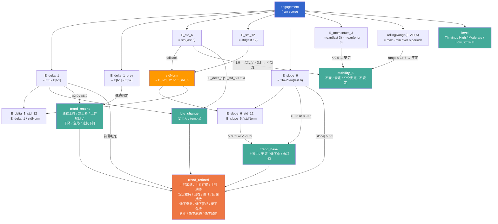

# evaluate.gs Evaluation Logic Reference

## 1. Computed Indexes

| Index | Formula | Description |
|-------|---------|-------------|
| `E_delta_1` | `engagement[t] - engagement[t-1]` | 直近1期の変化量 |
| `E_delta_1_prev` | `engagement[t-1] - engagement[t-2]` | 前回の1期変化量 |
| `E_std_6` | `stdOfLast(E, 6)` | 直近6期の標準偏差 |
| `E_std_12` | `stdOfLast(E, 12)` (12期以上必要) | 直近12期の標準偏差 |
| `stdNorm` | `E_std_12` (優先) or `E_std_6` (6期以上) | 標準化の分母 |
| `E_slope_6` | `theilSenSlope(E, 6)` | 直近6期のTheil-Sen傾き |
| `E_slope_6_std_12` | `E_slope_6 / stdNorm` | 標準化された傾き |
| `E_delta_1_std_12` | `E_delta_1 / stdNorm` | 標準化された1期変化量 |
| `E_momentum_3` | `mean(last 3) - mean(prior 3)` | 3期モメンタム |

## 2. Thresholds

| Constant | Value | Used by |
|----------|-------|---------|
| `TREND_SLOPE` | 0.5 | trend_base, trend_refined |
| `TREND_SLOPE_STD_MIN` | 0.2 | trend_base |
| `TREND_SLOPE_STD` | 0.55 | trend_base |
| `TREND_DELTA_STRONG` | 5.0 | (defined but unused) |
| `TREND_DELTA` | 1.0 | (defined but unused) |
| `TREND_RECENT_DELTA` | 2.0 | trend_recent |
| `BIG_CHANGE_PERSONAL_Z` | 2.4 | big_change |
| `CHANGE_TAG_THRESHOLD` | 6.0 | trend_recent (acute threshold) |
| `LEVEL_THRIVING` | 43 | level |
| `LEVEL_HIGH` | 32 | level |
| `LEVEL_LOW` | 11 | level |
| `LEVEL_CRITICAL` | 3 | level |
| `STABILITY_RANGE_EPS` | 1e-6 | stability_6 (不変判定) |
| `STABILITY_STD_STABLE` | 1.0 | stability_6 (安定判定) |
| `STABILITY_MOMENTUM_STABLE` | 0.5 | stability_6 (安定判定) |
| `STABILITY_STD_UNSTABLE` | 3.3 | stability_6 (不安定判定) |
| `MID_MIN_RECORDS` | 2 | hasMidHistory (rows > 2) |

## 3. Evaluation Factor: `level`

| Result | Condition | Threshold |
|--------|-----------|-----------|
| Thriving | `engagement > 43` | LEVEL_THRIVING |
| Critical | `engagement < 3` | LEVEL_CRITICAL |
| High | `engagement > 32` | LEVEL_HIGH |
| Low | `engagement < 11` | LEVEL_LOW |
| Moderate | otherwise | — |

*Evaluated in order; first match wins.*

## 4. Evaluation Factor: `stability_6` (requires hasMidHistory)

| Result | Conditions | Indexes & Thresholds |
|--------|------------|----------------------|
| 不変 | All 4 dimension ranges (E,V,D,A over 6 periods) ≤ eps | `rollingRange(E/V/D/A, 6)` ≤ `STABILITY_RANGE_EPS` (1e-6) |
| 安定 | E_std_6 < 1.0 AND \|E_momentum_3\| < 0.5 | `E_std_6` < `STABILITY_STD_STABLE`, \|`E_momentum_3`\| < `STABILITY_MOMENTUM_STABLE` |
| 不安定 | E_std_6 > 3.3 | `E_std_6` > `STABILITY_STD_UNSTABLE` |
| やや安定 | otherwise | — |

*Evaluated in order: 不変 → 安定 → 不安定 → やや安定.*

## 5. Evaluation Factor: `big_change`

| Result | Condition | Indexes & Thresholds |
|--------|-----------|----------------------|
| 変化大 | \|E_delta_1\| / E_std_6 > 2.4 | `E_delta_1`, `E_std_6`, `BIG_CHANGE_PERSONAL_Z` (2.4) |
| (empty) | otherwise | — |

## 6. Evaluation Factor: `trend_base` (requires hasMidHistory)

| Result | Condition | Thresholds |
|--------|-----------|------------|
| 上昇中 | (`E_slope_6` > 0.5 AND `E_slope_6_std_12` > 0.2) OR `E_slope_6_std_12` > 0.55 | `TREND_SLOPE`, `TREND_SLOPE_STD_MIN`, `TREND_SLOPE_STD` |
| 低下中 | (`E_slope_6` < -0.5 AND `E_slope_6_std_12` < -0.2) OR `E_slope_6_std_12` < -0.55 | same (negated) |
| 安定 | otherwise | — |
| 未評価 | !hasMidHistory | — |

## 7. Evaluation Factor: `trend_recent`

| Result | Condition | Thresholds |
|--------|-----------|------------|
| 横ばい | default | — |
| 下降 | -6.0 < `E_delta_1` < -2.0 | `TREND_RECENT_DELTA` (2.0), `CHANGE_TAG_THRESHOLD` (6.0) |
| 上昇 | 2.0 < `E_delta_1` < 6.0 | same |
| 急落 | `E_delta_1` ≤ -6.0 | `CHANGE_TAG_THRESHOLD` (6.0) |
| 急上昇 | `E_delta_1` ≥ 6.0 | `CHANGE_TAG_THRESHOLD` (6.0) |
| 連続下降 | `E_delta_1` < -2.0 AND `E_delta_1_prev` < -2.0 | `TREND_RECENT_DELTA` (2.0) |
| 連続上昇 | `E_delta_1` > 2.0 AND `E_delta_1_prev` > 2.0 | `TREND_RECENT_DELTA` (2.0) |

*Priority: 連続 > 急 > moderate > 横ばい (later assignments overwrite).*

## 8. Evaluation Factor: `trend_refined`

| Priority | Result | trend_base | trend_recent | big_change | Additional Conditions |
|----------|--------|------------|--------------|------------|----------------------|
| 1 | 上昇 | 未評価 | 上昇 or 急上昇 | — | — |
| 1 | 下降 | 未評価 | 下降 or 急落 | — | — |
| 1 | 横ばい | 未評価 | 横ばい (or others) | — | — |
| 2 | **上昇加速** | 上昇中 | 上昇/急上昇/連続上昇 | 変化大 | \|E_slope_6\| > 0.5 |
| 2 | **低下加速** | 低下中 | 下降/急落/連続下降 | 変化大 | \|E_slope_6\| > 0.5 |
| 3 | **上昇継続** | 上昇中 | 上昇/急上昇/連続上昇/横ばい | not 変化大 | \|E_slope_6\| > 0.5 AND E_delta_1 ≥ 0 |
| 3 | **低下継続** | 低下中 | 下降/急落/連続下降/横ばい | not 変化大 | \|E_slope_6\| > 0.5 AND E_delta_1 ≤ 0 |
| 4 | **復活** | 低下中 | 上昇/急上昇 | 変化大 | \|E_slope_6\| > 0.5 |
| 4 | **悪化** | 上昇中 | 下降/急落 | 変化大 | \|E_slope_6\| > 0.5 |
| 5 | **回復** | 低下中 | 上昇/急上昇/連続上昇 | not 変化大 | — |
| 5 | **低下危機** | 上昇中 | 下降/急落/連続下降 | not 変化大 | — |
| 6 | **上昇期待** | 安定 | 上昇/急上昇/連続上昇 | — | — |
| 6 | **低下警戒** | 安定 | 下降/急落/連続下降 | — | — |
| 7 | **低下懸念** | 上昇中 | 横ばい | — | E_delta_1 < 0 |
| 7 | **回復期待** | 低下中 | 横ばい | — | E_delta_1 > 0 |
| 8 | **安定維持** | 安定 | 横ばい | — | — |
| fallback | **安定維持** | — | — | — | — |

*First match wins (evaluated top to bottom).*

## 9. Dependency Flow

  The green nodes are the 5 intermediate evaluation factors, the red node is the final
  trend_refined (which synthesizes trend_base, trend_recent, big_change, and direct index
  checks), the blue node is the raw input, and the orange node is the stdNorm fallback
  logic.